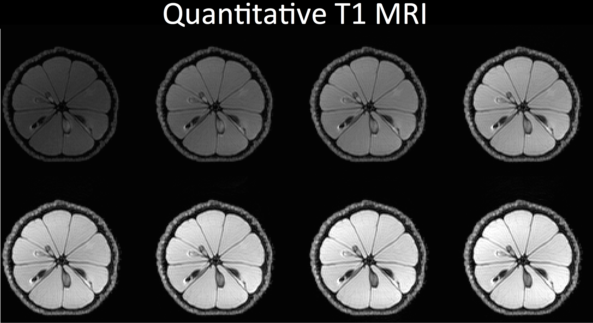

# Julia_vs_Python
A comparison of Julia and Python for medical imaging

Notebooks
1. [Julia basics]()

# Julia_vs_Python
A comparison of Julia and Python for medical imaging

## Notebooks
- Julia
1. [Basic syntaxis]( https://github.com/JCardenasRdz/Julia_vs_Python/blob/master/Basics_notebooks/Julia_Basics.ipynb
)
2. [Basic  benchmarks](https://github.com/JCardenasRdz/Julia_vs_Python/blob/master/Benchmark_notebooks/Benchmark_Julia.ipynb)
3. [Example of T1 mapping for MRI](https://github.com/JCardenasRdz/Julia_vs_Python/blob/master/T1_map_notebooks/Image_Processing_Julia_final.ipynb)
